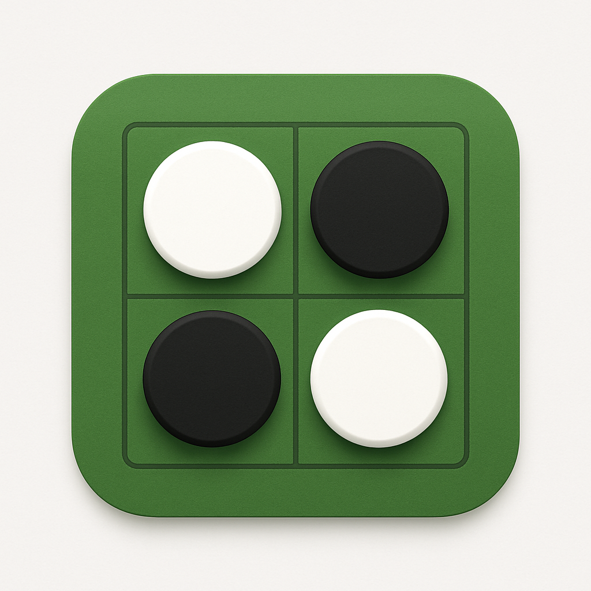

# Reversi

<div align="center">
  
</div>

A web-based Reversi (Othello) game built with **Vue.js** frontend and **Kotlin/Spring Boot** backend. Designed for fun, learning, and experimentation, supporting both AI and multiplayer games.

---

## Tech Stack

* **Frontend:** Vue 3, TypeScript, Nginx for static hosting
* **Backend:** Kotlin, Spring Boot, REST API (for testing), WebSocket (for real-time gameplay)
* **Build & Deployment:** Docker, Docker Compose

---

## Quick Start

Clone the repository and run the application using Docker:

```bash
git clone git@github.com:marcothuemmler/org.thuemmler.reversi.git
cd org.thuemmler.reversi
docker compose up --build -d
```

Open the game in your browser:

```
http://localhost:3000
```

Frontend API requests are automatically proxied to the backend (`localhost:8080`).

---

## Running Locally (Development Mode)

### Requirements

* JVM 21 or later
* Node.js 20+

### Frontend

```bash
cd frontend
npm install
npm run dev
```

Open in browser:

```
http://localhost:3000
```

API requests will proxy to the backend on `localhost:8080`.

### Backend

```bash
cd backend
./gradlew bootRun
```

---

## Backend API (Testing Only)

> The frontend primarily uses WebSocket for real-time gameplay. REST endpoints exist mainly for testing.

| Method | Endpoint                | Description                 |
| ------ | ----------------------- | --------------------------- |
| POST   | `/games`                | Start a new game            |
| GET    | `/games`                | List existing games         |
| GET    | `/games/{gameId}`       | Get a game by ID            |
| POST   | `/games/{gameId}/moves` | Make a move                 |
| GET    | `/games/{gameId}/moves` | Fetch valid moves           |
| POST   | `/games/{gameId}/undo`  | Undo last move              |
| POST   | `/games/{gameId}/redo`  | Redo previously undone move |
| DELETE | `/games/{gameId}`       | Delete a game               |

---

## WebSocket (Real-Time Gameplay)

The game uses WebSocket for **live board updates, moves, and game events**.

**Connection URL:**

```
ws://localhost:8080/ws/games
```

**Message Types:**

| Type       | Description                                             |
| ---------- | ------------------------------------------------------- |
| CREATE     | Client requests a new game                              |
| JOIN       | Client joins an existing game                           |
| MAKE\_MOVE | Player makes a move; server responds with updated board |
| UNDO       | Undo last move                                          |
| REDO       | Redo previously undone move                             |

**Notes:**

* Messages are JSON objects with `type`, optional `gameId`, and `payload`.
* `{gameId}` is required for joining or making moves in an existing game.
* `playerTypes` determine AI vs Multiplayer mode:

    * `{ "BLACK": "HUMAN", "WHITE": "AI" }` → Single-player against AI
    * `{ "BLACK": "HUMAN", "WHITE": "HUMAN" }` → Multiplayer
* Example JSON for a move:

```json
{
  "type": "MAKE_MOVE",
  "gameId": "1234-abcd",
  "payload": { "row": 2, "col": 3 }
}
```

* Example JSON for creating a new game:

```json
{
  "type": "CREATE",
  "payload": {
    "playerTypes": { "BLACK": "HUMAN", "WHITE": "AI" },
    "currentPlayer": "BLACK"
  }
}
```

---

## Docker Notes

* Frontend runs on port `3000`, served via Nginx, and proxies `/games` requests to the backend (see `frontend/nginx.conf`).
* Backend runs on port `8080` (see `docker-compose.yml`).

---

## License

This project is licensed under the MIT License. See [LICENSE](LICENSE) for details.
